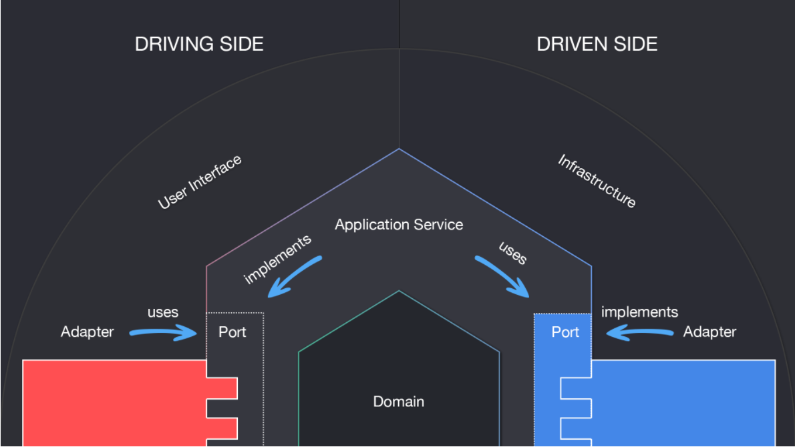

# Micronaut REST example

[comment]: <> (working at Chase for about two months in the Dynamo Cloud team)
[comment]: <> (Using Micronaut for about a year in production and is being currently used in Dynamo Cloud team)
[comment]: <> (The example project has been written in kotlin  , but all the mironaut setup, configuration  and annotations are identical when using Java)
[comment]: <> (The features of Mirconaut are to many to walk through in this presentation)
[comment]: <> (This presentation will focus a few features when building a rest micro-service )
[comment]: <> (Personally minimalist approach when using using the feastures of Micronaut)

The project demonstrates how a REST service can be built using micronaut

### Repo
- git clone https://github.com/adityajpm/micronaut-rest-example.git    

### Micronaut
Similar to Spring Boot but has faster boot time, as most of the framework logic is computed at compilation time. Micronaut uses byte code enrichment during compilation time. This eliminates need for Runtime Reflection, Runtime Proxies and Dynamic Class Loading.

[comment]: <> (Like Lombok Micronaut uses Annotation Processing to apply byte code enhancement)

### Setup
- Install JDK 17
- Micronaut requires Annotation Processing, see [ideaSetup](https://docs.micronaut.io/latest/guide/#ideaSetup) 
- Kotlin requires Kapt for Annotation Processing, see [kaptintellij](https://docs.micronaut.io/latest/guide/#kaptintellij)

### Useful Links

- [Micronaut Documentation](https://docs.micronaut.io/latest/guide/) 
- [Micronaut Guides](https://micronaut.io/guides/)
- [Micronaut Launch](https://micronaut.io/launch/)

[comment]: New Page

### Project Structure
- Overview  of project -  Hexagonal Architecture
- 
Structure / Hexagonal / Domain / Adapters / Application

for more info [Hexagonal Architecture article](https://medium.com/ssense-tech/hexagonal-architecture-there-are-always-two-sides-to-every-story-bc0780ed7d9c)

[comment]: New Page

###Starter.kt
- Entry Point -> Create Application Context using builder

[comment]: <> (passing Application Arguments, Packages to scan for Beans and main class )
[comment]: <> (show build.gradle.kts showing web adapter dependency )

###Application.yml
- application.yml properties can be overridden by system properties

###TransferEndPoint

[comment]: <> ( interface outlines the exposed web methods, @POST annotation )
  - Api.Endpoints.Transfer
  - Json Schema Validation used instead of Bean Validation Annotations (schema can be shared with frontend clients)
  - @Controller
  - @Context

[comment]: <> (@Controller works in the same way as in Spring )
[comment]: <> (@Context tells Micronaut this bean is eagerly instanstiated)
[comment]: <> (Using Schema validation as apposed Bean Validation, that a preference)

  - [comment]: <> (Controller annotation Write a few notes on Hexagonal Architecture, Find a diagram)
  - 
###TransferEndPointContractTest
  - Testing - Bean Replacing,  EmbeddedServer , Ktor Client, Mocking

###CORSEndpointTest
   - Using Options Method to confirm Http Server configured correctly

###ManagementEndpointsTest
   - /actuator/health/readiness  
   - /actuator/health/liveness 

###MetricsEndpointTest
   - Prometheus Micrometer
   - /actuator/prometheus

[comment]: <> (other notable features - Kubernetes Config Map Configuration, so Guides cloud )

